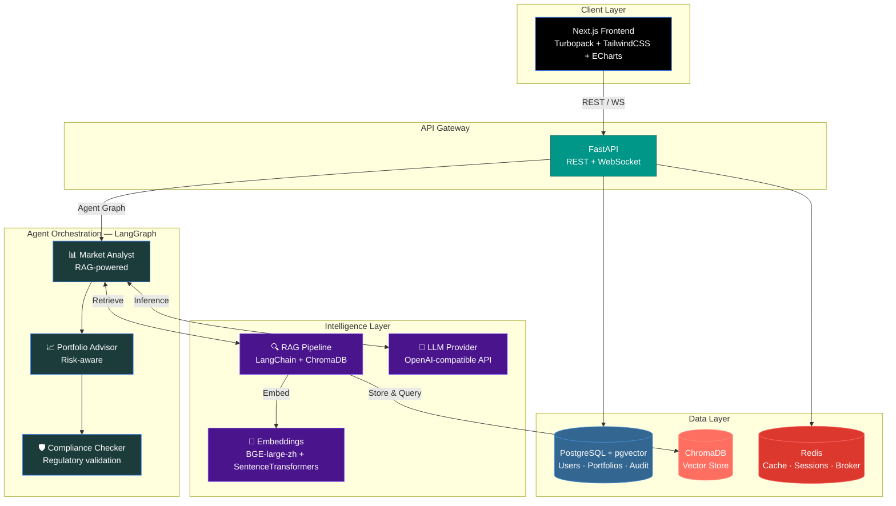

<p align="center">
  <picture>
    <source media="(prefers-color-scheme: dark)" srcset="https://img.shields.io/badge/SmartCycle-金仕达·智循-3b82f6?style=for-the-badge&logoColor=white">
    
  </picture>
</p>

<h1 align="center">SmartCycle · 金仕达·智循</h1>
<h3 align="center">AI-Native Financial Intelligence & Wealth Management Platform</h3>

<p align="center">
  <a href="https://www.python.org/downloads/"></a>
  <a href="https://nextjs.org/"></a>
  <a href="https://fastapi.tiangolo.com/"></a>
  <a href="https://www.langchain.com/langgraph"></a>
  <a href="https://www.trychroma.com/"></a>
  <a href="https://www.docker.com/"></a>
  <a href="LICENSE"></a>
  <a href="https://github.com/features/actions"></a>
</p>

<p align="center">
  <strong>B2B2C · Multi-Agent AI · RAG-Powered · Compliance-First</strong>
</p>

<p align="center">
  <a href="#-architecture">Architecture</a> ·
  <a href="#-core-features">Features</a> ·
  <a href="#-quick-start">Quick Start</a> ·
  <a href="#-project-structure">Structure</a> ·
  <a href="#-api-overview">API</a> ·
  <a href="#-roadmap">Roadmap</a>
</p>

---

## 🧠 Overview

**SmartCycle (金仕达·智循)** is an open-source, AI-native platform that bridges the gap between financial advisors and retail investors. It delivers three core capabilities through a unified multi-agent architecture powered by **LangGraph**:

| Service | Audience | Description |
|---|---|---|
| **🛠️ B-end Copilot** | Financial Advisors | AI-assisted research, portfolio construction, and client communication — all within a compliance guardrail. |
| **💬 C-end Companion** | Retail Investors | Empathetic, jargon-free market insights. Ask questions in plain Chinese (or English) and get actionable, risk-calibrated answers. |
| **🛡️ Compliance-as-a-Service** | Both | Real-time regulatory validation. Every piece of AI-generated financial communication is screened before it reaches a human. |

---

## 🏗️ Architecture



### Data Flow

1. **User sends a query** via the Next.js frontend (REST or WebSocket for streaming).
2. **FastAPI gateway** validates the request, resolves the user context, and dispatches to the LangGraph agent graph.
3. **Market Analyst** retrieves relevant context from the RAG pipeline (ChromaDB) and synthesizes market conditions via the LLM.
4. **Portfolio Advisor** combines the market analysis with the user's risk profile and goals to generate personalized advice.
5. **Compliance Checker** screens every word against regulatory policies — flagging, rewriting, or blocking non-compliant output.
6. **Response streams back** to the frontend with full traceability and audit logging.

---

## ✨ Core Features

### 🛠️ B-end Copilot — For Financial Advisors

- **AI Research Assistant** — Summarize earnings calls, macro reports, and sector trends in seconds.
- **Portfolio Builder** — Construct and stress-test model portfolios with natural-language prompts.
- **Client Brief Generator** — Turn raw data into polished, compliant client-facing summaries.
- **Multi-Asset Coverage** — Equities, bonds, ETFs, and structured products.

### 💬 C-end Companion — For Retail Investors

- **Natural Language Q&A** — "Should I rotate out of tech ETFs this quarter?" → calibrated, jargon-free answer.
- **Risk-Aware Responses** — Every answer is tailored to the user's stated risk tolerance and investment horizon.
- **Market Sentiment Dashboard** — AI-generated daily briefs with bull/bear indicators.
- **Financial Literacy Layer** — Explanations scale from beginner to advanced on demand.

### 🛡️ Compliance-as-a-Service

- **Real-Time Screening** — GPT-generated text is validated against customizable rule engines before delivery.
- **Regulatory Taxonomy** — Pre-built rule sets for China AMAC, CSRC, and international (SEC, MAS) frameworks.
- **Audit Trail** — Every AI decision is logged — what was generated, what was modified, and why.
- **Human-in-the-Loop** — Escalation workflows for borderline cases requiring advisor review.

---

## 🚀 Quick Start

### Prerequisites

- **Docker** & **Docker Compose** v2+
- **OpenAI API Key** (or any OpenAI-compatible endpoint)
- **Node.js 22+** and **Python 3.11+** (for local development without Docker)

### 1. Clone & Configure

```bash
git clone https://github.com/your-org/smartcycle.git
cd smartcycle

# Copy and edit environment variables
cp .env.example .env
# → Set OPENAI_API_KEY, tweak DB passwords, etc.
```

### 2. Docker Compose (Recommended)

```bash
# Start all services — frontend, backend, ChromaDB, PostgreSQL, Redis
docker compose up --build

# Services:
#   Frontend  → http://localhost:3000
#   Backend   → http://localhost:8000
#   API Docs  → http://localhost:8000/docs
#   ChromaDB  → http://localhost:8001
```

### 3. Local Development

**Backend:**
```bash
cd backend
python -m venv .venv && source .venv/bin/activate  # Windows: .venv\Scripts\activate
pip install -r requirements.txt
uvicorn app.main:app --reload --port 8000
```

**Frontend:**
```bash
cd frontend
npm install
npm run dev
# → http://localhost:3000
```

---

## 📁 Project Structure

```
smartcycle/
├── .github/
│   └── workflows/ci.yml              # CI/CD — lint, typecheck, test, build
├── backend/
│   ├── app/
│   │   ├── main.py                   # FastAPI entry point
│   │   ├── core/
│   │   │   ├── config.py             # Pydantic-settings configuration
│   │   │   └── security.py           # JWT auth & password hashing
│   │   ├── api/v1/
│   │   │   ├── router.py             # Aggregated v1 router
│   │   │   └── endpoints/            # copilot, companion, compliance
│   │   ├── agents/
│   │   │   ├── graph.py              # LangGraph state machine
│   │   │   └── nodes/                # market_analyst, portfolio_advisor, compliance_checker
│   │   ├── rag/
│   │   │   ├── embeddings.py         # Document chunking & embedding
│   │   │   ├── retriever.py          # Hybrid search (dense + sparse)
│   │   │   └── vector_store.py       # ChromaDB client
│   │   ├── models/                   # SQLAlchemy ORM models
│   │   └── services/                 # Business logic (market data, LLM, etc.)
│   ├── tests/
│   ├── requirements.txt
│   ├── Dockerfile
│   └── alembic.ini
├── frontend/
│   ├── src/
│   │   ├── app/                      # Next.js App Router
│   │   ├── components/
│   │   │   ├── ui/                   # shadcn/ui-style primitives
│   │   │   ├── charts/               # ECharts + Three.js visualizations
│   │   │   └── copilot/              # B-end specific components
│   │   ├── hooks/                    # Custom React hooks
│   │   ├── lib/                      # Utilities & API client
│   │   └── types/                    # TypeScript type definitions
│   ├── package.json
│   ├── tsconfig.json
│   ├── tailwind.config.ts
│   └── Dockerfile
├── docker-compose.yml                # Full-stack orchestration
├── .env.example
└── README.md
```

---

## 📡 API Overview

| Method | Endpoint | Description |
|---|---|---|
| `GET` | `/api/v1/health` | Health check |
| `POST` | `/api/v1/copilot/query` | B-end advisor query (RAG + agent pipeline) |
| `POST` | `/api/v1/companion/chat` | C-end investor chat (streaming) |
| `POST` | `/api/v1/compliance/check` | Validate text against regulatory rules |
| `GET` | `/api/v1/market/summary` | AI-generated daily market brief |
| `GET` | `/api/v1/portfolio/analysis` | Portfolio risk/return analytics |

> Full OpenAPI spec available at `http://localhost:8000/docs` after startup.

---

## 🧪 Tech Stack

| Layer | Technology | Why |
|---|---|---|
| **Frontend** | Next.js 15, TailwindCSS, ECharts, Three.js | SSR for SEO, beautiful data viz, 3D portfolio views |
| **API Gateway** | FastAPI (async), WebSocket | High-performance async, native streaming support |
| **Agent Framework** | LangGraph + LangChain | Stateful multi-agent orchestration with checkpointing |
| **Vector Store** | ChromaDB | Open-source, local-first, ideal for sensitive financial data |
| **Relational DB** | PostgreSQL 16 + pgvector | ACID compliance + vector search in one system |
| **Cache / Broker** | Redis | Session caching, async task queue |
| **LLM** | GPT-4o (OpenAI-compatible) | Swap with any provider via OpenAI-compatible API |
| **Infra** | Docker Compose, GitHub Actions | Reproducible dev environments, CI/CD |

---

## 🗺️ Roadmap

- [x] **Phase 1** — Project scaffolding, open-source facade, CI/CD
- [ ] **Phase 2** — Core agent graph (Market Analyst → Portfolio Advisor → Compliance Checker)
- [ ] **Phase 3** — RAG pipeline with financial document ingestion & hybrid search
- [ ] **Phase 4** — Streaming chat with WebSocket, real-time compliance overlays
- [ ] **Phase 5** — Multi-tenant B-end dashboard with client management
- [ ] **Phase 6** — Production hardening: rate limiting, observability (OTel), load testing

---

## 🤝 Contributing

We welcome contributions from the fintech and AI communities.

1. Fork the repository
2. Create a feature branch: `git checkout -b feature/amazing-feature`
3. Commit your changes: `git commit -m 'feat: add amazing feature'`
4. Push to the branch: `git push origin feature/amazing-feature`
5. Open a Pull Request

See [CONTRIBUTING.md](CONTRIBUTING.md) for detailed guidelines (coming soon).

---

## 📄 License

Distributed under the **Apache License 2.0**. See `LICENSE` for more information.

---

## ⚠️ Disclaimer

SmartCycle is an **AI-assisted tool**, not a substitute for professional financial advice. All investment decisions carry risk. The platform includes compliance guardrails, but ultimate responsibility for financial advice rests with the licensed professional.

<p align="center">
  <sub>Built with ❤️ for the future of intelligent wealth management · 金仕达·智循</sub>
</p>
