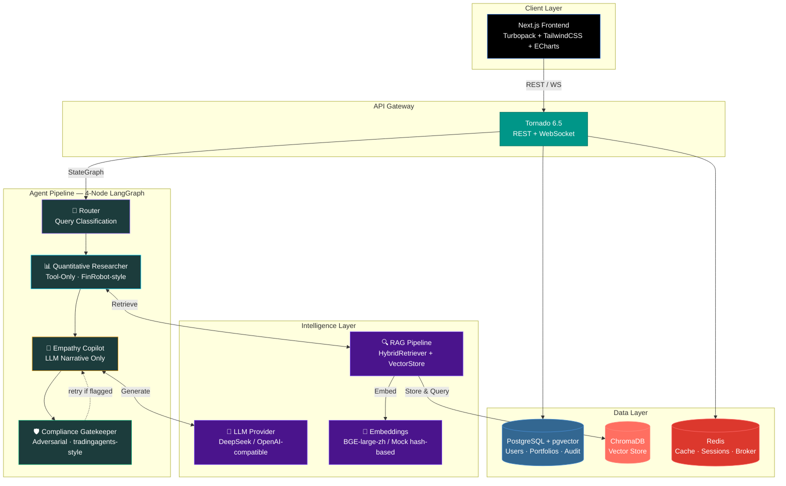

<p align="center">
  <picture>
    <source media="(prefers-color-scheme: dark)" srcset="https://img.shields.io/badge/SmartCycle-金仕达·智循-3b82f6?style=for-the-badge&logoColor=white">
    
  </picture>
</p>

<h1 align="center">SmartCycle · 金仕达·智循</h1>
<h3 align="center">AI-Native Financial Intelligence & Wealth Management Platform</h3>

<p align="center">
  <a href="https://www.python.org/downloads/"></a>
  <a href="https://nextjs.org/"></a>
  <a href="https://www.tornadoweb.org/"></a>
  <a href="https://www.langchain.com/langgraph"></a>
  <a href="https://www.trychroma.com/"></a>
  <a href="https://www.docker.com/"></a>
  <a href="LICENSE"></a>
  <a href="https://github.com/features/actions"></a>
</p>

<p align="center">
  <strong>B2B2C · Multi-Agent AI · RAG-Powered · Compliance-First</strong>
</p>

<p align="center">
  <a href="#-architecture">Architecture</a> ·
  <a href="#-core-features">Features</a> ·
  <a href="#-quick-start">Quick Start</a> ·
  <a href="#-project-structure">Structure</a> ·
  <a href="#-api-overview">API</a> ·
  <a href="#-roadmap">Roadmap</a>
</p>

---

## 🧠 Overview

**SmartCycle (金仕达·智循)** is an open-source, AI-native platform that bridges the gap between financial advisors and retail investors. It delivers three core capabilities through a unified multi-agent architecture powered by **LangGraph**:

| Service | Audience | Description |
|---|---|---|
| **🛠️ B-end Copilot** | Financial Advisors | AI-assisted research, portfolio construction, and client communication — all within a compliance guardrail. |
| **💬 C-end Companion** | Retail Investors | Empathetic, jargon-free market insights. Ask questions in plain Chinese (or English) and get actionable, risk-calibrated answers. |
| **🛡️ Compliance-as-a-Service** | Both | Real-time regulatory validation. Every piece of AI-generated financial communication is screened before it reaches a human. |

---

## 🏗️ Architecture



### Data Flow

1. **User sends a query** via the Next.js frontend (REST or WebSocket for streaming).
2. **Tornado API server** validates the request, resolves the user context, and dispatches to the agent graph.
3. **Router (Node 1)** classifies the query as data_fetching, research, or emotional_support — deterministic keyword matching, no LLM.
4. **Quantitative Researcher (Node 2)** extracts tickers, fetches market data, and retrieves RAG context — **tools only, no LLM narrative** (FinRobot separation principle).
5. **Empathy Copilot (Node 3)** generates a tone-calibrated, risk-aware narrative — **LLM only, no tool calls**.
6. **Compliance Gatekeeper (Node 4)** adversarially screens the draft — banned terms, suitability, and disclaimer attachment. On failure, loops back to Node 3 with revision notes (max 3 retries, then force-override).
7. **Response streams back** to the frontend with full compliance trace and audit logging.

---

## ✨ Core Features

### 🛠️ B-end Copilot — For Financial Advisors

- **AI Research Assistant** — Summarize earnings calls, macro reports, and sector trends in seconds.
- **Portfolio Builder** — Construct and stress-test model portfolios with natural-language prompts.
- **Client Brief Generator** — Turn raw data into polished, compliant client-facing summaries.
- **Multi-Asset Coverage** — Equities, bonds, ETFs, and structured products.

### 💬 C-end Companion — For Retail Investors

- **Natural Language Q&A** — "Should I rotate out of tech ETFs this quarter?" → calibrated, jargon-free answer.
- **Risk-Aware Responses** — Every answer is tailored to the user's stated risk tolerance and investment horizon.
- **Market Sentiment Dashboard** — AI-generated daily briefs with bull/bear indicators.
- **Financial Literacy Layer** — Explanations scale from beginner to advanced on demand.

### 🛡️ Compliance-as-a-Service

- **Real-Time Screening** — GPT-generated text is validated against customizable rule engines before delivery.
- **Regulatory Taxonomy** — Pre-built rule sets for China AMAC, CSRC, and international (SEC, MAS) frameworks.
- **Audit Trail** — Every AI decision is logged — what was generated, what was modified, and why.
- **Human-in-the-Loop** — Escalation workflows for borderline cases requiring advisor review.

---

## 🚀 Quick Start

### Prerequisites

- **Docker** & **Docker Compose** v2+
- **LLM API Key** (DeepSeek, OpenAI, Zhipu GLM, Qwen — any OpenAI-compatible provider)
- **Node.js 22+** and **Python 3.9+** (for local development without Docker)

### 1. Clone & Configure

```bash
git clone https://github.com/marylabeallisvito-byte/SmartCycle.git
cd SmartCycle

# Copy and edit environment variables
cp .env.example backend/.env
# → Set LLM_API_KEY to your provider's key, tweak DB passwords, etc.
```

### 2. Docker Compose (Recommended)

```bash
# Start all services — frontend, backend, ChromaDB, PostgreSQL, Redis
docker compose up --build

# Services:
#   Frontend  → http://localhost:3000
#   Backend   → http://localhost:8000
#   ChromaDB  → http://localhost:8001
```

### 3. Local Development

**Backend (Tornado — no extra pip install needed for core deps):**
```bash
cd backend
# Copy env template and add your LLM_API_KEY
cp ../.env.example .env
# Edit .env — set LLM_API_KEY to your DeepSeek/OpenAI key
# Start the Tornado API server
PYTHONPATH=. python -X utf8 server_tornado.py
# → http://localhost:8000
# → 14 endpoints available (13 REST + 1 WebSocket)
# → Note: /docs (Swagger UI) is only available on the FastAPI server, not Tornado
```

**Backend (FastAPI — requires pip install):**
```bash
cd backend
python -m venv .venv && source .venv/bin/activate  # Windows: .venv\Scripts\activate
pip install -r requirements.txt
uvicorn app.main:app --reload --port 8000
```

**Frontend:**
```bash
cd frontend
npm install
npm run dev
# → http://localhost:3000
```

---

## 📁 Project Structure

```
smartcycle/
├── .github/
│   └── workflows/ci.yml              # CI/CD — lint, typecheck, test, build
├── backend/
│   ├── server_tornado.py             # ★ Primary API server — 13 REST + 1 WS endpoint
│   ├── app/
│   │   ├── agents.py                 # ★ 4-node agent pipeline (Router → Researcher → Copilot → Compliance)
│   │   ├── graph.py                  # StateGraph compilation + _SimplePipeline fallback
│   │   ├── llm.py                    # OpenAILikeLLM + MockLLM + env loader
│   │   ├── tools.py                  # fetch_market_data + hybrid_retrieve + web_search
│   │   ├── schema.py                 # Pydantic models + AgentState TypedDict
│   │   ├── main.py                   # FastAPI entry point (preserved)
│   │   ├── core/
│   │   │   ├── config.py             # Pydantic-settings configuration
│   │   │   └── security.py           # JWT auth & bcrypt password hashing
│   │   ├── api/v1/
│   │   │   ├── router.py             # FastAPI sub-router aggregation
│   │   │   └── endpoints/            # copilot.py, companion.py, compliance.py
│   │   ├── models/                   # SQLAlchemy ORM — 8 models with graceful stubs
│   │   ├── rag/                      # HybridRetriever + VectorStore + EmbeddingProvider
│   │   └── services/                 # MarketDataService, LLMService, PortfolioService
│   ├── tests/                        # 43 tests — schema, compliance, agents
│   ├── requirements.txt
│   ├── Dockerfile
│   └── alembic.ini
├── frontend/
│   ├── src/
│   │   ├── app/                      # Next.js App Router (dashboard + layout)
│   │   ├── components/
│   │   │   ├── ChatInterface.tsx     # Chat + Compliance Shield + Agent Trace
│   │   │   ├── Client3DProfile.tsx   # Three.js 3D risk profile visualization
│   │   │   ├── MarketTicker.tsx      # Real-time scrolling index ticker
│   │   │   └── charts/               # ECharts sunburst/donut
│   │   ├── lib/                      # 12 typed API functions, useChat hook, mock data, utils
│   │   └── types/                    # TypeScript types — aligned with backend schema
│   ├── package.json
│   ├── tsconfig.json
│   ├── tailwind.config.ts
│   └── Dockerfile
├── docker-compose.yml                # Full-stack orchestration (5 services)
├── .env.example                      # 50+ config vars
└── README.md
```

---

## 📡 API Overview

| Method | Endpoint | Description |
|---|---|---|
| `GET` | `/api/v1/health` | Health check |
| `POST` | `/api/v1/auth/login` | JWT authentication (demo user) |
| `POST` | `/api/v1/chat` | Full multi-agent pipeline (core) |
| `GET` | `/api/v1/graph/info` | Agent pipeline introspection |
| `GET` | `/api/v1/copilot` | B-end copilot service status |
| `POST` | `/api/v1/copilot/query` | B-end advisor research query |
| `GET` | `/api/v1/companion` | C-end companion service status |
| `POST` | `/api/v1/companion/chat` | C-end retail investor chat |
| `GET` | `/api/v1/compliance` | Compliance service status |
| `POST` | `/api/v1/compliance/check` | Standalone compliance screening |
| `GET` | `/api/v1/compliance/rules` | List active compliance rules |
| `GET` | `/api/v1/market/summary` | Major indices snapshot |
| `POST` | `/api/v1/portfolio/analysis` | Portfolio risk/return analytics |
| `WS` | `/ws/v1/chat` | WebSocket streaming chat |

> **14 endpoints** (including WebSocket) served by the Tornado API server on `http://localhost:8000`.

---

## 🧪 Tech Stack

| Layer | Technology | Why |
|---|---|---|
| **Frontend** | Next.js 15, TailwindCSS, ECharts, Three.js | SSR for SEO, beautiful data viz, 3D portfolio views |
| **API Gateway** | Tornado 6.5 (primary) / FastAPI (preserved) | Async-native, Python 3.9 compatible |
| **Agent Framework** | LangGraph + LangChain | Stateful multi-agent orchestration with checkpointing |
| **Vector Store** | ChromaDB | Open-source, local-first, ideal for sensitive financial data |
| **Relational DB** | PostgreSQL 16 + pgvector | ACID compliance + vector search in one system |
| **Cache / Broker** | Redis | Session caching, async task queue |
| **LLM** | DeepSeek / GPT-4o / Zhipu GLM / Qwen | OpenAI-compatible, configurable via LLM_BASE_URL |
| **Infra** | Docker Compose, GitHub Actions | Reproducible dev environments, CI/CD |

---

## 🗺️ Roadmap

- [x] **Phase 1** — Project scaffolding, open-source facade, CI/CD
- [x] **Phase 2** — Core agent graph (Router → Researcher → Copilot → Compliance Gatekeeper)
- [x] **Phase 3** — Frontend dashboard with 3D visualization + chat interface
- [x] **Phase 4** — Full-stack wiring, compliance hardening, Chinese banned terms
- [x] **Phase 5** — Real LLM integration (DeepSeek) + real-time market data (akshare/yfinance)
- [x] **Phase 6** — RAG pipeline, full API surface, test suite (43 tests), WebSocket streaming
- [ ] **Phase 7** — Database integration (PostgreSQL + Alembic migrations active)
- [ ] **Phase 8** — Production hardening: rate limiting, observability (OTel), load testing

---

## 🤝 Contributing

We welcome contributions from the fintech and AI communities.

1. Fork the repository
2. Create a feature branch: `git checkout -b feature/amazing-feature`
3. Commit your changes: `git commit -m 'feat: add amazing feature'`
4. Push to the branch: `git push origin feature/amazing-feature`
5. Open a Pull Request

See [CONTRIBUTING.md](CONTRIBUTING.md) for detailed guidelines.

---

## 📄 License

Distributed under the **Apache License 2.0**. See `LICENSE` for more information.

---

## ⚠️ Disclaimer

SmartCycle is an **AI-assisted tool**, not a substitute for professional financial advice. All investment decisions carry risk. The platform includes compliance guardrails, but ultimate responsibility for financial advice rests with the licensed professional.

<p align="center">
  <sub>Built with ❤️ for the future of intelligent wealth management · 金仕达·智循</sub>
</p>
